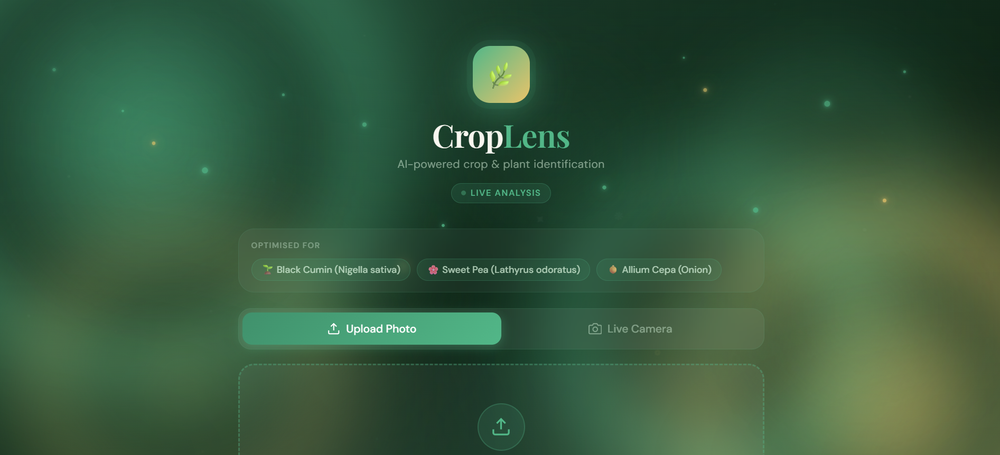

# CropLens - AI
## Flower Classification & Dataset Pipeline (3-Class)

An end-to-end Computer Vision project for flower classification and dataset engineering, designed for research and real-world AI applications.

## Overview

This project focuses on building a robust flower dataset (3 classes) and applying deep learning techniques for classification and preprocessing.

### It includes:

1.Dataset collection & cleaning;

2.Background removal pipeline;

3.Data augmentation;

4.Model training & evaluation.

## Objectives:
1.Build a high-quality flower dataset;

2.Remove noisy backgrounds for better feature learning;

3.Train a high-performance classification model;

4.Provide a reproducible pipeline for research use.

## Preview

## Methodology:
### 1. Data Preprocessing
Background removal using OpenCV / rembg;
Image resizing (e.g., 224x224);
Noise filtering.
### 2. Data Augmentation
Rotation;
Flipping;
Brightness adjustment.
### 3. Model Architecture
CNN / Transfer Learning;
Loss: CrossEntropyLoss;
Optimizer: Adam.
